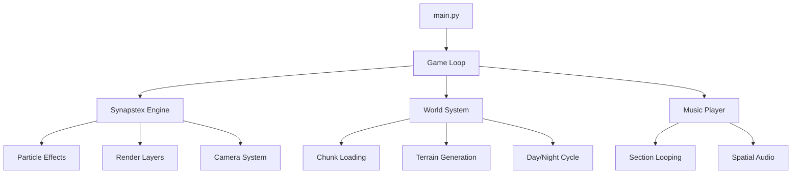

# 📁 Runic Lands - Project Structure

> *Comprehensive file tree and architecture documentation*

## 🌳 Complete File Tree

```
Runic_Lands/
│
├── 🎮 main.py                           # Main game entry point
├── 🚀 launch_game.bat                   # Windows one-click launcher
├── 📜 LICENSE                           # Open source license
├── 🗃️ .gitignore                        # Git ignore patterns
├── 📖 README.md                         # Project overview and quick start
│
├── 🎯 entities/                         # Character and entity classes
│   ├── character.py                     # Base character class
│   └── player.py                        # Player-specific functionality
│
├── 🌍 systems/                          # Core game systems
│   ├── combat.py                        # Combat mechanics and damage
│   ├── inventory.py                     # Equipment and item management
│   ├── menu.py                          # Menu system and UI
│   ├── music_player.py                  # Audio management and playback
│   ├── options.py                       # Game settings and configuration
│   ├── options_menu.py                  # Options UI interface
│   ├── pause_menu.py                    # In-game pause functionality
│   ├── save_manager.py                  # Save/load with validation
│   ├── sprite.py                        # Sprite loading and management
│   ├── stats.py                         # Character statistics system
│   ├── synapstex.py                     # 🎨 Custom graphics engine
│   ├── world.py                         # World generation and rendering
│   ├── world_generator.py               # Procedural world creation
│   │
│   └── effects/                         # Visual effects system
│       └── fireworks.py                 # Particle effects for celebrations
│
├── 🎬 scenes/                           # Game scenes and states
│   └── main_menu.py                     # Main menu interface
│
├── 🎨 assets/                           # Game assets and resources
│   ├── audio/                           # Sound and music files
│   │   ├── attack.wav                   # Combat sound effect
│   │   ├── menu_click.wav               # UI click sound
│   │   ├── menu_select.wav              # UI selection sound
│   │   ├── game_theme.wav               # Main game theme
│   │   ├── menu_section1.wav            # Menu music part 1
│   │   ├── menu_section2.wav            # Menu music part 2
│   │   ├── ...                          # Additional menu sections
│   │   ├── menu_section10.wav           # Menu music part 10
│   │   └── game/                        # In-game music
│   │       ├── game_section1.wav        # Game music part 1
│   │       ├── ...                      # Additional game sections
│   │       └── game_section10.wav       # Game music part 10
│   │
│   └── sprites/                         # Visual assets
│       └── characters/                  # Character graphics
│           └── player/                  # Player character assets
│               └── png/                 # PNG format sprites
│                   ├── base_body.png            # Player body base
│                   ├── base_clothing.png        # Player clothing
│                   ├── base_wanderer.png        # Player walking sprite
│                   └── base_wanderer_idle.png   # Player idle animation
│
├── 📚 docs/                             # Documentation and guides
│   ├── 📖 DOCUMENTATION_INDEX.md        # Documentation roadmap
│   ├── 🔄 PROJECT_CONTEXT.md            # Project history and context
│   ├── 📊 CODEBASE_ANALYSIS.md          # Code structure analysis
│   ├── 🧹 CLEANUP_COMPLETED.md          # Cleanup task documentation
│   ├── 🎯 PHASE2_COMPLETED.md           # Phase 2 milestone summary
│   ├── 🐛 PHASE3_BUGFIXES.md            # Phase 3 bug fix log
│   ├── ✅ PHASE3_COMPLETION.md          # Phase 3 completion status
│   ├── 🔥 PHASE3_HOTFIXES.md            # Critical fixes in Phase 3
│   ├── 🌿 GRASS_RENDERING_FIX.md        # Terrain rendering fix details
│   ├── 📋 requirements.txt              # Python dependencies
│   ├── 🎮 SpriteGuide.md                # Sprite creation and usage guide
│   ├── 🎯 audio_generation.md           # Audio asset creation guide
│   ├── 📝 git_commands.md               # Git workflow documentation
│   │
│   ├── 🎵 music/                        # Audio system documentation
│   │   ├── MenuMusicSystem.md           # Menu music implementation
│   │   ├── RunicMelodys.md              # Music composition notes
│   │   └── Research_CursorMusic.txt     # Music system research
│   │
│   └── 🔧 tech/                         # Technical documentation
│       ├── CHARACTER_SPRITES.md         # Character graphics system
│       ├── class_system.md              # Class and inheritance structure
│       ├── CORE_SYSTEMS.md              # Core system documentation
│       ├── EQUIPMENT_SYSTEM.md          # Equipment mechanics
│       ├── fireworks_effect.md          # Particle effects system
│       ├── flying_system.md             # Movement and physics
│       ├── HERO_SYSTEM.md               # Player character system
│       ├── integrate_fireworks.md       # Effects integration guide
│       ├── PARTICLE_SYSTEM.md           # Particle engine documentation
│       ├── PAUSE_MENU.md                # Pause system implementation
│       ├── PROJECT_STRUCTURE.md         # This file
│       ├── REFACTORING.md               # Code refactoring notes
│       ├── save_system.md               # Save/load system documentation
│       ├── skill_system.md              # Skills and abilities system
│       ├── SPRITES.md                   # Sprite system documentation
│       ├── synapstex_grafix.md          # Synapstex engine details
│       ├── TECHNICAL_OVERVIEW.md        # High-level architecture
│       └── WORLD_GENERATION.md          # World creation algorithms
│
├── 🛠️ tools/                            # Development utilities
│   ├── audio_manager.py                 # Audio generation and management
│   ├── fix_audio.bat                    # Audio system repair script
│   ├── quick_fix_audio.bat              # Quick audio fix utility
│   └── audio/                           # Audio tool documentation
│       └── README.md                    # Audio tool usage guide
│
├── 🗺️ maps/                             # Level and map data
│   └── level1.json                      # First level configuration
│
├── 💾 saves/                            # Game save files (gitignored)
│   ├── backups/                         # Automatic save backups
│   ├── Save_20250403_094024.sav         # Example save file
│   ├── Save_20250403_094024.meta        # Save metadata
│   └── ...                              # Additional saves
│
├── 📊 logs/                             # Game logs (gitignored)
│   └── game_log_20250623_183452.txt     # Current session log
│
├── 🌍 world/                            # Generated world data (gitignored)
│   └── chunks/                          # World chunk files
│       ├── chunk_0_0.json               # World chunk (0,0)
│       ├── chunk_0_1.json               # World chunk (0,1)
│       └── ...                          # Additional chunks
│
├── 🔧 utils/                            # Utility modules
│   ├── __init__.py                      # Package initialization
│   └── generators.py                    # Helper generation functions
│
├── 📜 rules/                            # Development rules and guidelines
│   └── documentation-first.rules        # Documentation-first development
│
├── 🎮 ui_elements.py                    # UI components and widgets
│
└── 🎨 Asset Generation Scripts/         # Sprite generation utilities
    ├── generate_assets.py               # General asset generation
    ├── generate_attack_sprite.py        # Combat animation generation
    ├── generate_base_sprite.py          # Base character sprite creation
    └── generate_walking_sprite.py       # Walking animation generation
```

## 🏗️ Architecture Overview

### 🎯 **Core Entry Points**
- **`main.py`**: Primary game loop and initialization
- **`launch_game.bat`**: User-friendly Windows launcher with dependency management

### 🎮 **Game Systems** (`systems/`)
| System | Purpose | Key Features |
|--------|---------|--------------|
| **synapstex.py** | 🎨 Graphics Engine | Particle systems, rendering pipeline, effects |
| **world.py** | 🌍 World Management | Terrain generation, chunk loading, rendering |
| **save_manager.py** | 💾 Persistence | Save/load with validation and backups |
| **music_player.py** | 🎵 Audio | Seamless looping, spatial audio |
| **combat.py** | ⚔️ Combat | Damage calculation, attack mechanics |
| **inventory.py** | 🎒 Items | Equipment management, item systems |

### 🎨 **Synapstex Graphics Engine**
The custom graphics engine includes:
- **Particle Systems**: Autumn leaves, magical effects, environmental particles
- **Render Layers**: Depth-sorted drawing with optimization
- **Camera System**: Smooth tracking with world boundaries
- **Day/Night Cycle**: Dynamic lighting and celestial bodies
- **Animation Management**: Character and sprite animations

### 📁 **Asset Organization**
- **Audio**: Section-based music system with seamless looping
- **Sprites**: Organized character graphics with animation support
- **Generated Content**: World chunks and saves excluded from version control

### 📚 **Documentation Structure**
- **Technical Docs**: Detailed system documentation in `docs/tech/`
- **Music System**: Audio implementation details in `docs/music/`
- **Project Management**: Phase completion and milestone tracking

### 🛠️ **Development Tools**
- **Audio Manager**: Unified audio generation and management
- **Sprite Generators**: Automated character sprite creation
- **Batch Scripts**: Windows-friendly development utilities

## 🔄 **Data Flow**



## 📊 **File Statistics**

| Category | Count | Purpose |
|----------|-------|---------|
| **Core Systems** | 15 files | Game logic and mechanics |
| **Documentation** | 25+ files | Comprehensive project docs |
| **Audio Assets** | 23 files | Music and sound effects |
| **Sprite Assets** | 4 files | Character graphics |
| **Tools** | 8 files | Development utilities |
| **Generated Content** | Variable | World chunks, saves, logs |

## 🎯 **Key Design Principles**

1. **Modular Architecture**: Clear separation of concerns
2. **Documentation-First**: Comprehensive docs for all systems
3. **Asset Pipeline**: Automated generation and management
4. **Performance Focus**: Optimized rendering and memory usage
5. **Clean Repository**: Proper gitignore and organization

---

*This structure supports scalable development with clear organization and comprehensive documentation for all team members.* 